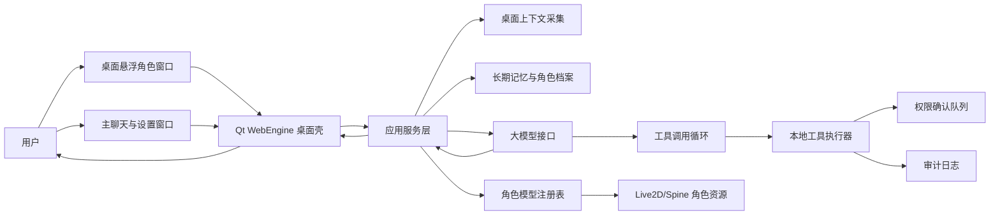
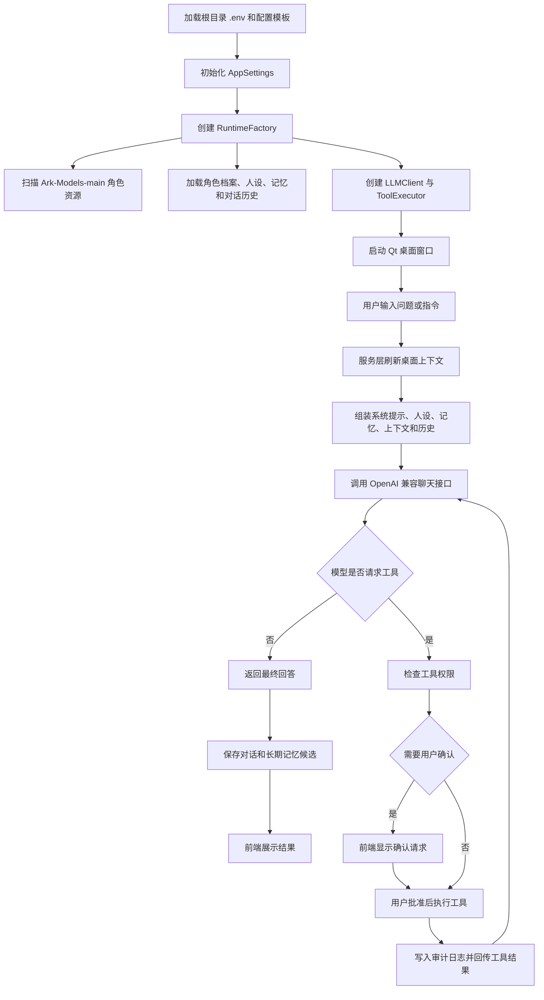
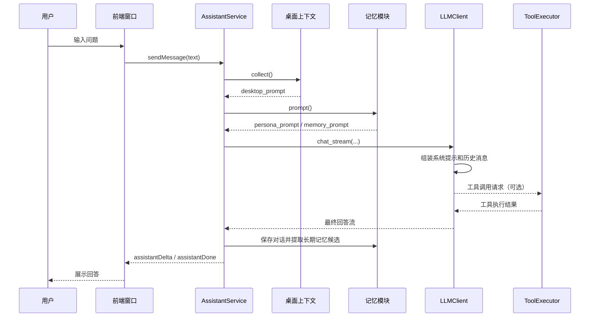
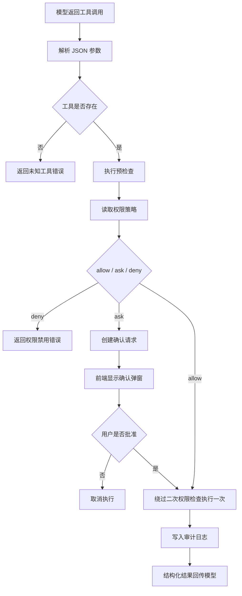

# 桌面智能体助手技术文档

本文档用于小组成员整合《大模型应用开发技术》课程项目报告。内容依据当前提交包中的代码、配置、测试记录和资源说明整理，重点覆盖学校报告模板中“项目概述、项目实施、项目展示、项目总结”可复用的技术部分。本文不填写班级、成员姓名学号和个人总结，避免影响小组最终统一排版。

## 1 项目概述

### 1.1 项目的目的和意义

桌面智能体助手面向学习、办公和日常桌面使用场景，目标是构建一个可以长期停留在桌面上的智能应用。传统聊天机器人通常运行在网页或移动端，用户需要主动切换窗口、复制上下文、描述当前任务。本项目把智能体放到桌面端，通过悬浮角色窗口、桌面上下文采集、工具调用和长期记忆，让用户在当前工作环境中直接获得辅助。

项目的现实意义主要体现在以下几个方面：

- 降低桌面场景中的交互成本。用户可以点击桌面角色唤起聊天，不需要频繁打开浏览器或切换应用。
- 提升回答的上下文相关性。程序可以把当前前台应用、窗口标题、可访问文本等结构化上下文提供给大模型，减少用户重复描述背景。
- 探索大模型智能体的工程化落地。项目不仅调用大模型生成文本，还实现了工具 schema、权限确认、审计日志、长期记忆和多角色档案。
- 兼顾隐私和可控性。默认不发送截图图片，只传递结构化文本上下文；高风险或需要谨慎处理的动作可以设置为每次确认。
- 支持课程展示和后续扩展。项目具备可运行桌面界面、可配置模型资源、自动化测试和清晰模块边界，便于小组成员分工维护。

本项目符合课程要求中的“具有一定创新性、能有实际用途解决实际问题的智能应用”。智能体相关工作主要集中在上下文感知、大模型调用、工具调用、记忆管理和权限安全控制，属于项目的核心工作量。

### 1.2 项目的开发内容

项目开发内容可以概括为“桌面端智能体应用 + 本地角色渲染 + 大模型服务编排 + 工具安全控制”。主要内容如下：

| 开发内容 | 主要目标 | 对应模块 |
| --- | --- | --- |
| 桌面窗口与角色交互 | 提供悬浮角色、主聊天窗口、设置面板和确认弹窗 | `qt_app.py`、`ui/` |
| 大模型对话 | 通过 OpenAI 兼容接口调用 DeepSeek 等模型 | `llm.py` |
| 智能体编排 | 组合系统提示、人设、记忆、桌面上下文、工具结果和历史对话 | `service.py`、`runtime.py` |
| 桌面上下文 | 读取前台应用、窗口标题和可用结构化文本 | `desktop_context.py` |
| 工具调用 | 支持打开网页、网页搜索、打开路径、定位路径、启动应用和记忆管理 | `tools.py` |
| 权限与审计 | 对工具动作执行允许、询问、拒绝策略，并记录调用结果 | `confirmations.py`、`audit.py` |
| 长期记忆 | 保存稳定偏好、项目背景和工作流信息 | `memory.py` |
| 多角色档案 | 管理不同角色的人设、记忆、设置和对话记录 | `profiles.py` |
| 角色资源发现 | 扫描 Live2D 和 Spine 3.8 模型资源 | `model_sources.py`、`models.py`、`model_registry.py` |
| 配置与启动 | 提供 `.env`、TOML 配置、启动脚本和检查命令 | `settings.py`、`config/`、`scripts/` |
| 测试验证 | 覆盖设置、模型扫描、记忆、工具、服务层等关键逻辑 | `tests/` |

整体开发内容图如下，可在报告中作为“图 1 项目整体开发内容图”的基础：



### 1.3 项目技术路线

项目采用 Python 桌面应用作为主体，前端界面嵌入 Qt WebEngine，使用 JavaScript 完成页面状态管理和角色渲染，后端通过 OpenAI 兼容接口接入大模型。智能体流程由服务层统一编排，工具能力以 schema 形式暴露给模型，模型返回工具调用请求后，由本地工具执行器按权限策略执行。

技术路线图如下，可在报告中作为“图 2 项目技术路线图”的基础：



## 2 项目实施

### 2.1 智能处理模块的设计和开发

智能处理模块是本项目的核心。它不是把用户输入直接转发给大模型，而是在每轮对话前组合多类上下文，让模型具备“知道用户是谁、当前在做什么、可以调用什么工具、哪些动作需要谨慎处理”的能力。

智能处理模块的主要输入包括：

- 用户本轮输入：来自主聊天窗口或迷你聊天气泡。
- 系统提示：规定模型角色、语言风格、工具调用边界和高风险动作处理原则。
- 人设提示：来自当前角色档案的名称、角色定位、性格、说话风格和固定指令。
- 长期记忆：从本地 `memory.json` 中读取稳定偏好、项目背景、工作流信息。
- 桌面上下文：由 `DesktopContextCollector` 采集前台应用、窗口标题和结构化文本。
- 历史对话：当前角色档案的最近聊天记录。
- 工具定义：由 `TOOL_SPECS` 提供可调用工具名称、描述和参数 schema。

服务层 `AssistantService.chat_stream()` 是智能处理链路的入口。该方法在收到用户消息后，先刷新上下文和记忆，再调用 `LLMClient.chat_stream()`。`LLMClient` 内部会构造 OpenAI 兼容聊天消息列表，并在最多 4 轮工具调用内完成“模型决定工具、工具返回结果、模型继续回答”的循环。

智能处理流程如下：



#### 2.1.1 数据预处理

项目中的“数据”不是传统训练数据，而是运行时输入、配置、上下文、资源索引和本地状态。数据预处理主要解决不同来源数据格式不统一、敏感信息不能泄露、资源路径需要跨平台解析的问题。

配置数据预处理：

- `.env` 用于保存本机接口密钥和路径，根目录优先加载。
- `config/settings.example.toml` 提供可复制的配置模板。
- `config/model_sources.toml` 默认指向 `./Ark-Models-main`，保证提交包可以直接扫描课程演示资源。
- `settings.py` 使用 dataclass 定义配置结构，统一转换为 `AppSettings`。
- `public_dict()` 输出配置时会隐藏包含 `KEY`、`TOKEN`、`SECRET` 的敏感值。

角色资源预处理：

- `model_sources.py` 解析配置文件、环境变量和命令行参数中的模型目录。
- `models.py` 扫描 `.model3.json` 识别 Live2D 模型，扫描 `.skel/.atlas/.png` 识别 Spine 3.8 模型。
- `model_registry.py` 将扫描结果转换为 `ModelManifest` 列表，供前端设置面板选择。
- 当前提交包检查结果显示，`./Ark-Models-main` 可扫描到 886 个 `spine38` 模型。

桌面上下文预处理：

- `desktop_context.py` 将系统窗口信息转换为可读文本，而不是把完整截图直接发给模型。
- 默认配置 `send_screenshots = false`，避免上传截图图片。
- OCR 默认关闭，相关权限默认为拒绝或需要显式配置。
- 上下文长度通过 `max_context_chars` 控制，避免 prompt 过长。

长期记忆预处理：

- `memory.py` 将长期记忆保存为结构化 JSON。
- 记忆条目包含内容、类别、重要性、来源和时间信息。
- 保存时过滤明显敏感内容，例如密钥、密码、验证码、令牌等。
- 注入 prompt 时按数量和字符数限制，减少无关记忆干扰回答。

对话历史预处理：

- 每个角色档案拥有独立的 `conversations.jsonl`。
- 服务层只将近期历史注入本轮对话，避免历史过长。
- 对话保存与角色档案绑定，切换角色时状态重新加载。

表 1 可用于报告中说明主要数据类型：

| 数据类型 | 来源 | 处理方式 | 输出 |
| --- | --- | --- | --- |
| 环境变量 | `.env`、系统环境 | 解析键值、隐藏敏感值 | `AppSettings` |
| TOML 配置 | `config/`、角色档案 | 读取并映射为 dataclass | 运行时配置 |
| 角色模型 | `Ark-Models-main/` | 扫描模型文件和元数据 | `ModelManifest` |
| 桌面上下文 | 操作系统 API | 提取结构化文本 | `desktop_prompt` |
| 长期记忆 | `memory.json` | 过滤敏感信息、限制数量 | `memory_prompt` |
| 对话历史 | `conversations.jsonl` | 读取近期记录 | 聊天消息列表 |
| 工具调用 | 大模型返回 | JSON 参数解析、权限检查 | 结构化工具结果 |

#### 2.1.2 工具调用模块的设计和开发

工具调用模块位于 `tools.py`，由工具 schema、工具执行器、权限策略和审计日志组成。项目使用 OpenAI 兼容的 function calling 思路，让模型在需要时请求本地工具，而不是让模型直接执行系统命令。

当前工具列表如下：

| 工具名称 | 功能 | 主要参数 | 风险控制 |
| --- | --- | --- | --- |
| `get_desktop_context` | 获取当前桌面上下文摘要 | 无 | 可配置允许或拒绝 |
| `open_path` | 打开本地文件或目录 | `path` | 默认询问 |
| `reveal_path` | 在文件管理器中定位本地路径 | `path` | 默认询问 |
| `open_url` | 打开明确的 HTTP/HTTPS URL | `url` | 默认询问，只允许 http/https |
| `web_search` | 调用浏览器进行网页搜索 | `query` | 默认允许，仅传关键词 |
| `launch_app` | 启动本地应用 | `name` | 默认询问 |
| `save_memory` | 保存长期记忆 | `content`、`category`、`importance` | 默认询问并过滤敏感内容 |
| `list_memories` | 列出长期记忆 | 无 | 默认允许 |
| `update_memory` | 更新已有记忆 | `memory_id`、更新内容 | 默认询问 |
| `delete_memory` | 删除记忆 | `memory_id` | 默认询问 |

工具执行结果统一采用结构化字典，包含 `ok`、`action`、`result`、`error`、`requires_confirmation` 等字段。这样做的好处是模型和前端都能明确判断工具是否成功、是否需要用户确认、失败原因是什么。

权限策略由 `PermissionsSettings` 控制，每个工具可设置为：

- `allow`：允许直接执行。
- `ask`：生成确认请求，等待用户在界面中批准。
- `deny`：拒绝执行并返回错误信息。

工具调用安全流程如下：



工具模块中还包含若干额外安全边界：

- `open_url` 只允许打开 `http` 或 `https` URL。
- 网页搜索必须调用 `web_search`，不允许模型自行拼接搜索引擎 URL。
- 本地路径工具会拒绝明显指向其他用户主目录的路径。
- 所有工具调用都会写入 `logs/tool_calls.jsonl`，便于回溯。

#### 2.1.3 技能模块的设计和开发

学校模板中的“SKILL”可理解为智能体可复用能力模块。本项目没有依赖外部技能框架，而是通过“工具 schema + 执行器 + 权限策略 + 服务编排”实现技能化能力。

项目中的技能可以分为五类：

| 技能类别 | 对应能力 | 实现方式 |
| --- | --- | --- |
| 感知技能 | 读取桌面上下文 | `get_desktop_context` 与 `desktop_context.py` |
| 检索技能 | 网页搜索和打开链接 | `web_search`、`open_url` |
| 本地操作技能 | 打开路径、定位文件、启动应用 | `open_path`、`reveal_path`、`launch_app` |
| 记忆技能 | 保存、查询、更新、删除长期记忆 | `memory.py` 与记忆工具 |
| 安全技能 | 权限确认、审计记录、敏感信息过滤 | `confirmations.py`、`audit.py` |

技能模块的设计原则：

- 每个技能有清晰输入和输出，不直接暴露任意系统命令。
- 模型只负责选择技能和提供参数，本地程序负责执行和校验。
- 高风险技能默认需要用户确认。
- 技能结果以 JSON 形式返回，方便模型继续推理。
- 新增技能时只需补充工具 schema、处理函数和测试用例。

这种设计降低了模型误操作系统的风险，也便于小组后续扩展新的技能，例如剪贴板读取、当前文件摘要、课程资料检索等。

#### 2.1.4 智能体的设计和开发

本项目智能体由五个能力层组成：感知、记忆、推理、行动和安全。

感知层：

- 读取当前桌面结构化信息。
- 记录前台应用、窗口标题和可访问文本。
- 将桌面环境压缩成模型可理解的 prompt。

记忆层：

- 维护角色人设和长期记忆。
- 自动从对话中提取稳定信息候选。
- 保存记忆前过滤敏感内容。
- 不同角色档案互相隔离。

推理层：

- 使用系统提示定义智能体边界。
- 使用人设提示控制表达风格。
- 使用历史消息保持连续对话。
- 使用工具结果进行多轮补充推理。

行动层：

- 通过工具 schema 暴露能力。
- 支持网页、路径、应用和记忆相关操作。
- 将工具执行结果反馈给模型继续生成回答。

安全层：

- 使用权限策略限制工具执行。
- 对需要谨慎的动作显示确认请求。
- 记录工具调用日志。
- 默认不上传截图图片。

智能体的核心提示包括三类：

- 普通对话系统提示：要求默认中文、简洁可执行、按用户明确意图调用网页工具、遇到高风险操作先说明确认。
- 主动提醒提示：只在确实有帮助时输出一句简短提醒，否则输出 `SILENT`。
- 记忆提取提示：只提取稳定、可复用、非敏感的信息，并要求输出 JSON。

### 2.2 前端的设计和开发

前端由 Qt 桌面壳和 Web 前端两部分组成。

Qt 桌面壳：

- `qt_app.py` 创建桌面窗口。
- 使用 `QWebEngineView` 加载本地 HTML 页面。
- 使用 `QWebChannel` 暴露 Python 方法给 JavaScript 调用。
- 通过 Signal 把模型流式回答、完成事件和主动提醒广播给前端。
- 维护两个主要窗口：悬浮角色窗口和主聊天设置窗口。

Web 前端：

- `ui/index.html` 提供页面结构。
- `ui/styles.css` 定义悬浮角色、聊天面板、设置面板和消息样式。
- `ui/app.js` 管理前端状态、调用 Qt Bridge、渲染聊天消息、处理模型列表和设置变更。
- `ui/vendor/` 保存 PixiJS、Live2D、Spine 相关渲染库。

前端交互流程：

1. 用户点击桌面角色，打开迷你聊天气泡。
2. 用户输入消息，前端调用 `bridge.sendMessage(text)`。
3. Python 后端启动后台线程处理模型请求。
4. 后端通过 `assistantDelta` 信号逐段返回模型回答。
5. 回答完成后触发 `assistantDone`，前端更新消息状态。
6. 如果工具需要确认，前端显示确认弹窗，用户批准后调用确认接口。
7. 设置面板读取 `public_state()`，展示模型列表、权限状态、当前角色档案和运行配置。

角色渲染方面，项目支持扫描 Live2D 和 Spine 模型。当前提交包自带 `Ark-Models-main/`，检查结果显示可扫描出 886 个 Spine 3.8 模型。前端在角色资源缺失或渲染库不可用时会显示备用状态，避免程序直接崩溃。

### 2.3 后端的设计和开发

后端采用小模块分层设计，每个模块承担相对单一的职责。

| 模块 | 职责 |
| --- | --- |
| `settings.py` | 读取 `.env`、TOML 和环境变量，生成类型化配置 |
| `env.py` | 加载根目录环境变量文件 |
| `model_sources.py` | 解析模型来源目录 |
| `models.py` | 扫描 Live2D 和 Spine 模型 |
| `model_registry.py` | 管理模型清单和当前模型 |
| `memory.py` | 管理人设和长期记忆 |
| `profiles.py` | 管理多角色档案、对话历史和档案索引 |
| `desktop_context.py` | 采集桌面上下文 |
| `tools.py` | 定义和执行本地工具 |
| `confirmations.py` | 管理待确认工具请求 |
| `audit.py` | 写入工具调用审计日志 |
| `llm.py` | 调用 OpenAI 兼容聊天接口并处理工具调用循环 |
| `runtime.py` | 统一装配运行依赖 |
| `service.py` | 协调聊天、设置、档案、记忆和工具执行 |
| `qt_app.py` | 连接后端服务和桌面前端 |

后端配置加载顺序：

1. 加载项目根目录 `.env`。
2. 如果存在配置文件，则加载 TOML。
3. 在必要时读取进程环境变量作为兜底。
4. 将配置映射到 dataclass。
5. 服务启动时根据配置创建模型注册表、记忆存储、工具执行器和大模型客户端。

后端持久化目录：

- `data/assistants/index.toml`：角色档案索引。
- `data/assistants/<profile>/settings.toml`：角色级运行设置。
- `data/assistants/<profile>/persona.toml`：角色人设。
- `data/assistants/<profile>/memory.json`：长期记忆。
- `data/assistants/<profile>/conversations.jsonl`：聊天记录。
- `logs/tool_calls.jsonl`：工具调用日志。

这些运行态文件由 `.gitignore` 排除，不进入提交仓库。

### 2.4 配置、启动与跨平台支持

项目提供两种常用启动方式：

```bash
bash scripts/start.sh
```

```bat
scripts\start.bat
```

也可以直接执行：

```bash
desktop-assistant
```

检查配置和模型扫描：

```bash
conda run -n desktop-assistant python -m desktop_assistant --check
```

提交包默认模型来源为：

```toml
[[sources]]
name = "明日方舟角色资源"
path = "./Ark-Models-main"
enabled = true
```

macOS 上如需读取更完整桌面上下文，需要给终端或应用授予辅助功能权限。Windows 支持核心体验，包括 Qt GUI、聊天、设置、模型发现、打开 URL、打开或定位本地路径、启动应用等；部分 macOS 专属上下文能力会降级。

## 3 项目展示

以下用例适合写入报告“项目展示”章节，也适合答辩演示时逐项展示。

### 3.1 用例一：配置检查与模型扫描

演示目标：证明项目能够加载配置并识别角色资源。

操作步骤：

1. 进入提交包根目录。
2. 执行 `conda run -n desktop-assistant python -m desktop_assistant --check`。
3. 查看输出中的模型来源和模型数量。

预期结果：

- `model_source_dirs` 包含 `./Ark-Models-main`。
- `models_found` 为 886。
- `model_kinds` 包含 `spine38`。

### 3.2 用例二：启动桌面角色窗口

演示目标：展示桌面端用户入口。

操作步骤：

1. 配置 `.env` 中的大模型接口密钥。
2. 执行 `bash scripts/start.sh` 或 `scripts\start.bat`。
3. 桌面出现悬浮角色窗口。
4. 拖动角色或使用滚轮调整大小。

预期结果：

- 应用启动后显示桌面角色。
- 点击角色可以打开迷你聊天入口。
- 展开后可以进入主聊天窗口和设置面板。

### 3.3 用例三：桌面上下文问答

演示目标：展示智能体根据当前桌面信息辅助用户。

操作步骤：

1. 打开一个有明确窗口标题的应用。
2. 在助手中询问“我现在大概在处理什么任务？”。
3. 观察回答中是否结合前台应用和窗口标题。

预期结果：

- 助手不会声称看到了截图图片。
- 助手会基于结构化桌面文本上下文进行判断。

### 3.4 用例四：网页搜索工具

演示目标：展示工具调用能力。

操作步骤：

1. 输入“帮我网页搜索大模型应用开发技术相关资料”。
2. 模型识别到明确网页搜索意图。
3. 调用 `web_search` 工具打开浏览器搜索。

预期结果：

- 工具只传搜索关键词。
- 浏览器打开搜索结果页面。
- 工具调用结果写入审计日志。

### 3.5 用例五：本地路径工具与权限确认

演示目标：展示安全控制机制。

操作步骤：

1. 将 `open_path` 或 `reveal_path` 权限设置为询问。
2. 请求助手打开某个本地路径。
3. 查看前端确认弹窗。
4. 点击批准后执行。

预期结果：

- 未批准前不执行实际打开动作。
- 批准后只执行一次原始工具请求。
- 工具结果返回给模型和前端。

### 3.6 用例六：长期记忆

演示目标：展示智能体保存长期偏好。

操作步骤：

1. 对助手说“请记住，我更喜欢中文、简洁、直接的回答。”
2. 助手调用 `save_memory` 或在对话结束后提取长期记忆。
3. 后续对话中观察回答风格。

预期结果：

- 记忆内容被保存到当前角色档案。
- 明显敏感信息不会被保存。
- 记忆只在对应角色档案中生效。

### 3.7 用例七：多角色档案

演示目标：展示角色状态隔离。

操作步骤：

1. 在设置面板中新建角色档案。
2. 切换不同角色档案。
3. 分别查看人设、记忆、默认模型和对话历史。

预期结果：

- 不同角色的记忆和对话历史相互独立。
- 切换档案后服务层重新加载对应状态。

### 3.8 用例八：主动提醒

演示目标：展示低频主动交互能力。

操作步骤：

1. 在设置中启用主动提醒。
2. 设置合理的最小间隔和冷却时间。
3. 保持应用运行，观察是否在合适时机出现简短提醒。

预期结果：

- 不值得提醒时模型输出 `SILENT`，前端不打扰用户。
- 有帮助时只显示一句简短提醒。

## 4 测试与验证

### 4.1 自动化测试

测试命令：

```bash
conda run -n desktop-assistant python -m pytest
```

提交包整理后的测试结果：

```text
57 passed
```

测试覆盖范围包括：

- 配置加载和运行时设置保存。
- 模型来源解析和模型扫描。
- 长期记忆保存、敏感信息过滤和重载。
- 多角色档案创建、切换、删除和历史隔离。
- 大模型工具调用循环。
- 工具权限、确认请求、网页搜索和路径安全检查。
- 服务层聊天、主动提醒和记忆提取流程。

### 4.2 配置检查

检查命令：

```bash
conda run -n desktop-assistant python -m desktop_assistant --check
```

提交包检查结果中的关键字段：

```text
model_source_dirs: ["./Ark-Models-main"]
models_found: 886
model_kinds: ["spine38"]
```

这说明提交包默认模型来源可以正常解析，角色资源能够被扫描，应用可以在不启动 GUI 的情况下完成基础运行检查。

### 4.3 提交安全检查

提交包通过 `.gitignore` 排除了以下内容：

- `.env`
- `data/`
- `logs/`
- `node_modules/`
- `.pytest_cache/`
- 构建产物和 Python 缓存
- 本机专用配置文件

角色资源已纳入 Git，但 `.gitattributes` 将 `.png` 和 `.skel` 标记为 binary，避免 Git 按文本方式处理二进制差异。检查结果显示资源目录没有超过 100M 的单文件。

## 5 项目总结材料

### 5.1 项目整体总结

桌面智能体助手完成了一个可运行的桌面端大模型应用原型。项目将大模型对话、桌面上下文、工具调用、长期记忆、权限确认和角色渲染整合到一个应用中，体现了智能体应用从“文本问答”向“可感知、可行动、可记忆”的方向扩展。

从工程角度看，项目具有以下特点：

- 模块边界清晰，便于分工和测试。
- 大模型接口采用 OpenAI 兼容方式，便于替换不同供应商。
- 工具调用采用 schema 和执行器分离设计，便于扩展。
- 权限确认和审计日志提高了本地工具执行的可控性。
- 运行态数据和敏感配置默认不进入仓库。
- 提交包包含角色资源、启动脚本、测试记录和中文文档，便于课程提交和答辩展示。

### 5.2 可改进方向

项目后续可以继续扩展：

- 增加剪贴板、浏览器标签页、当前文件摘要等上下文来源。
- 增加用户审核记忆的界面，让长期记忆更可控。
- 增加任务队列和多步任务执行状态。
- 增加更细粒度的工具权限策略。
- 增加跨平台桌面上下文采集能力。
- 为前端交互增加更多自动化或截图验证。

## 6 报告整合建议

组员整合最终 Word 或 PDF 报告时，可以按以下方式使用本文档：

- “1 项目概述”可直接改写自本文第 1 章。
- “1.2 项目的开发内容”可使用开发内容表和整体开发内容图。
- “1.3 项目技术路线”可使用技术路线图。
- “2.1 智能处理模块的设计和开发”可使用本文第 2.1 节。
- “2.1.1 数据预处理”可使用本文数据预处理表。
- “2.1.2 工具调用或者 MCP 的设计和开发”可使用工具调用模块章节。
- “2.1.3 SKILL 的设计和开发”可使用技能模块设计章节。
- “2.1.4 智能体的设计和开发”可使用智能体五层能力说明。
- “2.2 前端的设计和开发”可使用前端章节。
- “2.3 后端的设计和开发”可使用后端章节。
- “3 项目展示”可从 8 个用例中选择适合演示的场景。
- “4 项目总结”可使用整体总结和可改进方向，再补充小组成员个人总结。

## 7 资源版权声明

本项目包含的《明日方舟》相关角色模型资源版权归上海鹰角网络有限公司所有。相关资源仅用于课程学习、技术研究和本地演示，不用于任何商业活动，不损害版权方利益。如需正式发布或商业使用，应另行取得权利方授权。

资源来源说明保留在 `Ark-Models-main/README.md`，提交包中的 `docs/resource-notice.md` 也记录了资源使用边界。
